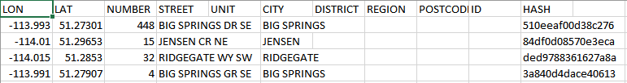
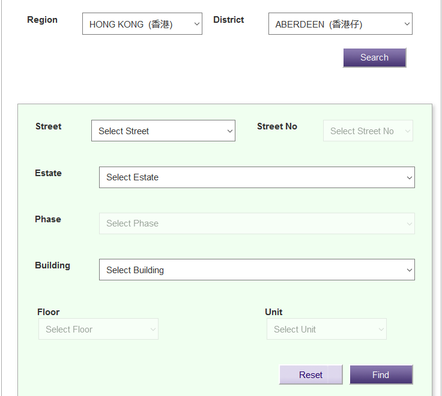
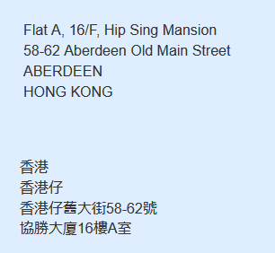
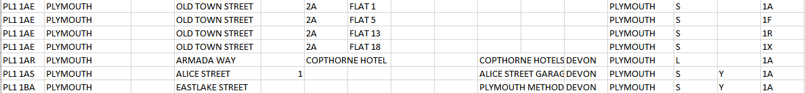
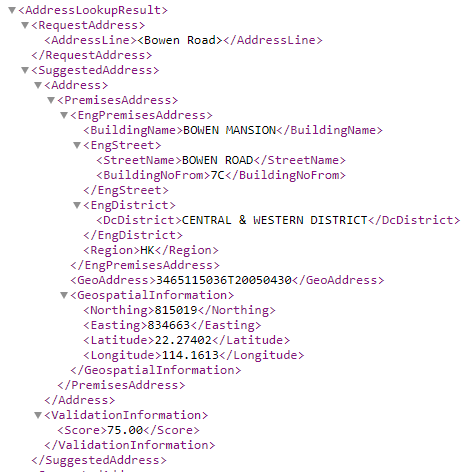
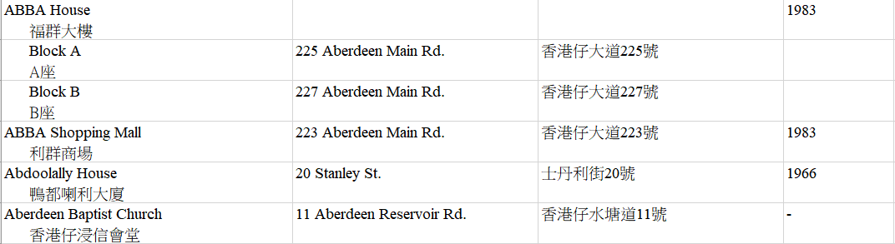
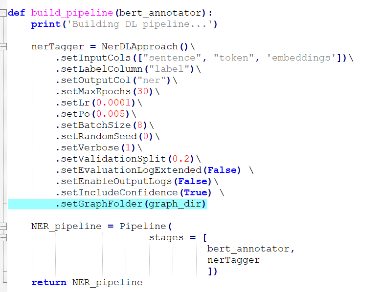

# Introduction

### Overall Structure
- preprocessing pipeline
- formating pipeline
- training pipeline
- prediction pipeline

# Google Cloud Use

## Data Sources and Preparation
Five data sources were used to collect and gather data. The sources are:

### OpenAddresses
OpenAddresses provides a dataset consisting of structured CSVs. The CSVs are structured by address fields.

OpenAddresses is 39 GB in size. The dataset can be found [here](https://results.openaddresses.io/).

Data from OpenAddresses is sent directly into the data processing pipeline.

### OpenStreetMap
OpenStreetMap provides a dataset consisting of longitude and latitude coordinates.

This data is then taken and run through a reverse geocoder from OpenCage. This returns a dictionary of dictionaries for each address. The dictionary is parsed through for each address field and the information is formatted into a structured CSV which is then used.

OpenStreetMap is 93 GB in size. The dataset can be found [here](https://planet.openstreetmap.org/).

The following [link](https://extract.bbbike.org/) provides OpenStreetMap data in more manageable sizes.

### Hong Kong Post
Hong Kong Post provides address data for Hong Kong as a string, written as a person would write them. The addresses have to be constructed using the drop down menu.

A formatted address is then returned.

These address strings are parsed into their individual address fields and then formatted into a structured CSV that can be used.

The link to constructing these addresses can be found [here, under "Search by Structured Address"](https://www.hongkongpost.hk/correct_addressing/index.jsp?lang=en_US).

### Royal Mail
Royal Mail provides address data for the UK. An account is needed to access their data. For our purposes we used their sample data set.

A header needed to be added to their CSVs in order to be used in the data processing pipeline.

The sample dataset can be found [here](https://www.poweredbypaf.com/using-our-address-data/use-the-data-yourself/download-sample-data/).

The sample dataset is 120 MB in size.

### DATA.GOV.HK
DATA.GOV.HK provides address data for Hong Kong in two different ways. The first way is through their address lookup service which requires the user to input a building name, street name and number, or estate name and block number. A list of associated addresses are then returned in XML format.

These addresses are gathered, parsed to exclude XML tags, and formatted into a structured CSV that can be sent into the data processing pipeline.

The lookup service can be found [here](https://data.gov.hk/en-data/dataset/hk-ogcio-st_div_02-als/resource/a62a0573-8afb-4dc8-86dc-70c9859cdf86).

The second way is through their datasets which contain addresses for buildings. 

Each address from these CSVs has to be read, split between English and Chinese, and then formatted into a structured CSV that can be used.

The datasets together are 8 MB in size.

The data can be found [here](https://data.gov.hk/en-data/dataset/hk-rvd-tsinfo_rvd-names-of-buildings).

## Data Processing

The data preprocessing is done through Google Cloud Platform's [Dataflow](https://cloud.google.com/dataflow).  The code for which can be found [here](https://github.com/Beaver-2020/postal-parser/tree/master/preprocessing-pipeline).

While the notebook can be run from a local computer, the easiest way to run the preprocessing pipeline is through a virtual machine run on GCP.  This way all of the dependencies required for Apache Beam come preinstalled and configured.

### Setting up a GCP notebook

A GCP notebook is easiest to set up through the GCP console. In the GCP console, start by navigating to Dataflow (through the search bar or through the left hand hamburger menu).  You will then see on the left hand side of the screen two options to select, Jobs and Notebooks.  If you select notebooks, you can then hit New Instance to create a new VM to run your Notebook in.

If using Maplequad, set the region to europe-west1 and the zone to europe-west1-b.  Hit customize and you can change the machine type to n1-standard-1 for lower costs. You can then create the machine.

Once your machine is set up you can open the Notebook hosted through your VM by hitting OPEN JUPYTERLAB (this may take some time to load after you set up your VM).  Once you open your Jupyer Notebook, you can copy the code into the Notebook.

### Running the Pipeline

Once the code is entered into the notebook, the pipeline can be run by running all cells in the notebook.  **Before you run**, ensure you update the User Controlled Variables cell to match your current GCP project, and ensure your unprocessed data is set up correctly (see below).  Once you run, one of the bottom cells will output a link that takes you to a page where you can monitor the job's progress.  On the entire Open Addresses dataset (~40GB), the job takes around 45 minutes on average and uses around 200 worker nodes. 

### Setting up your data

All of the data should be located within a folder inside of which has folders representing each of the data sources you are collecting data from.  Within that folder, data can be organized into subfolders. The pipeline will assume that if there are subfolders within the data source folder, then the first layer of folder names represent the country of addresses within that folder.  The second layer represents the state of addresses within that folder.  The filename is assumed to represent the city or municipality of addresses within that file, unless the filename contains the words *state*, *country*, *province*, *wide*, or a number (eg. state_wide.csv would not represent a city name and would be ignored).  See below for an example file structure.

.INPUT_LOCATION  
&nbsp; &nbsp; +--subfolder  
&nbsp; &nbsp; &nbsp; &nbsp; +--country1  
&nbsp; &nbsp; &nbsp; &nbsp; | &nbsp; +--state1  
&nbsp; &nbsp; &nbsp; &nbsp; | &nbsp; | &nbsp; +--city1.csv  
&nbsp; &nbsp; &nbsp; &nbsp; | &nbsp; | &nbsp; +--city2.csv  
&nbsp; &nbsp; &nbsp; &nbsp; | &nbsp; +--state2  
&nbsp; &nbsp; &nbsp; &nbsp; | &nbsp; | &nbsp; +--file1.csv  
&nbsp; &nbsp; &nbsp; &nbsp; +-country2  
&nbsp; &nbsp; &nbsp; &nbsp; | &nbsp; +--province1  
&nbsp; &nbsp; &nbsp; &nbsp; | &nbsp; +--countrywide.csv  
&nbsp; &nbsp; &nbsp; &nbsp; +-country3  
&nbsp; &nbsp; &nbsp; &nbsp; | &nbsp; +--countrywide.csv  
&nbsp; &nbsp; &nbsp; &nbsp; |-...

## Model Pipeline
Spark NLP is an open source natural language processing library, built on top of Apache Spark and Spark ML. In the sparknlp library, lots of annotators are provided which can simplifies the data preprocessing stage for any natural language processing problem.

Helpful resources for Spark-nlp:
 - [Spark NLP Walkthrough, powered by TensorFlow](https://medium.com/@saif1988/spark-nlp-walkthrough-powered-by-tensorflow-9965538663fd)
 - [Spark-nlp documentation](https://nlp.johnsnowlabs.com/docs/en/quickstart)
 
 
### NerDLApproach()
NerDLApproach() is a general deep learning solution provided by sparknlp library to solve any NER problem. In this approach, CNN is used to get the char representation, a type of pretrained word embedding method is used to get the word representation, Bi-LSTM to learn the language patterns and the CRF layer to improve labelling accuracy by learning the order in which entities appear in addresses. In this project, the goal is to customize the NerDLApproach() with our adsress dataset to achieve higher accuracy and robustness than that of LibPostal's solution.  

The `NerDLApproach()` is explained in our notebook [here.](https://github.com/Beaver-2020/postal-parser/blob/master/training/NERDLApproach.ipynb) In this notebook, conll class in the sparknlp library is used to parse the text data in the conll style and annotate it to the format required for the NerDLApproach(). The example of our data with conll format is [here.](https://github.com/Beaver-2020/postal-parser/blob/master/data/test_CoNLL_addresses.txt) This conll class stopped working when you give it bigger txt file with more than 1 million records as the input. Therefore we implemented the new notebook [here](https://github.com/Beaver-2020/postal-parser/blob/master/training/Postal-parser-pipelines.ipynb), replicated what conll class does in the sparknlp library and read directly from open address dataset in the CSV format. This makes us not requiring anymore to transform our data to the txt file with conll format.

### Steps for training the model on GCP
 1.  Create cluster using create_clusters.sh
 2.  Apply preprocessing pipeline to generate the data and save it on GS.
 3.  Create graph for the model using the [notebook.](https://github.com/Beaver-2020/postal-parser/blob/master/training/create_graph.ipynb) and save it to the GS bucket and specifying the path in the graph_path in the python file. The parameters of the graph should be specified based on the data you have.
 4.  Submit pyspark job using submit_job.sh. (https://github.com/Beaver-2020/postal-parser/tree/master/Formatting%20and%20training%20pipeline)
 5.  Optimize the model based on the results.
 6.  Test on bank data and repeat the process with randomized data.
 
 ### Distributed Training
Currently, our solution is not scalable since  we have not been able to successfully parallelize the data during training on the GCP cluster. There are two main steps in order to train in distributed way:
- configure the gcp infrastructure for training-two options: 

     - build a cluster with multiple preemtiple workers (async parameter server architecture)
     - build a single VM instance with multiple core and multiple GPUs (syn Allreduce architecture)
- Call the distribution strategy API on the tensorflow code

Some useful links for how to do distributed training in tensorflow is mentioned below:

- [distributed training in tensorflow:](https://www.youtube.com/results?search_query=distributed+training+tensorflow)
- [TensorFlow CPUs and GPUs Configuration:](https://medium.com/@liyin2015/tensorflow-cpus-and-gpus-configuration-9c223436d4ef)
### Tensorflow graph for NerDLApproach()
The graph path can be specified in the input to the training pipeline. This should only be done if there is an error `Could not find a suitable tensorflow graph for embeddings`.

### Ideas to consider for next steps

 - Improve performance of the model by experimenting with different word embeddings. Use fasttext word embedding (subword embeddings), multilanguage BERT embeddings to see if there is a significant improvement in performance. Fasttext embedding can significantly reduce OOV problem in our prediction.
 - Consider the training separate models for different regions grouped by languange and use a pretrained language classifier.
 - Consider adding external features which has good power for adress tagging prediction to our word and char representation before passing to BILSTM model.
 - [Leveraging Subword Embeddings for Multinational Address Parsing](https://deepai.org/publication/leveraging-subword-embeddings-for-multinational-address-parsing)
 

