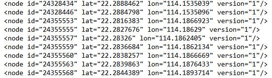

# Introduction

# Google Cloud Use

# Data Sources and Preparation
Five data sources were used to collect and gather data. The sources are:

### OpenAddresses
OpenAddresses provides a dataset consisting of structured CSVs. The CSVs are structured by address fields.

OpenAddresses is 39 GB in size. The dataset can be found [here](https://results.openaddresses.io/).

Data from OpenAddresses is sent directly into the data processing pipeline.

### OpenStreetMap
OpenStreetMap provides a dataset consisting of longitude and latitude coordinates.

This data is then taken and run through a reverse geocoder from OpenCage. This returns a dictionary of dictionaries for each address. The dictionary is parsed through for each address field and the information is formatted into a structured CSV which is then used.

OpenStreetMap is 93 GB in size. The dataset can be found [here](https://planet.openstreetmap.org/).

The following [link](https://extract.bbbike.org/) provides OpenStreetMap data in more manageable sizes.

### Hong Kong Post
Hong Kong Post provides address data for Hong Kong as a string, written as a person would write them. The addresses have to be constructed using the drop down menu.

A formatted address is then returned.

These address strings are parsed into their individual address fields and then formatted into a structured CSV that can be used.

The link to constructing these addresses can be found [here, under "Search by Structured Address"](https://www.hongkongpost.hk/correct_addressing/index.jsp?lang=en_US).

### Royal Mail
Royal Mail provides address data for the UK. An account is needed to access their data. For our purposes we used their sample data set.

A header needed to be added to their CSVs in order to be used in the data processing pipeline.

The sample dataset can be found [here](https://www.poweredbypaf.com/using-our-address-data/use-the-data-yourself/download-sample-data/).

The sample dataset is 120 MB in size.

### DATA.GOV.HK
DATA.GOV.HK provides address data for Hong Kong in two different ways. The first way is through their address lookup service which requires the user to input a building name, street name and number, or estate name and block number. A list of associated addresses are then returned in XML format.

These addresses are gathered, parsed to exclude XML tags, and formatted into a structured CSV that can be sent into the data processing pipeline.

The lookup service can be found [here](https://data.gov.hk/en-data/dataset/hk-ogcio-st_div_02-als/resource/a62a0573-8afb-4dc8-86dc-70c9859cdf86).

The second way is through their datasets which contain addresses for buildings. 

Each address from these CSVs has to be read, split between English and Chinese, and then formatted into a structured CSV that can be used.

The datasets together are 8 MB in size.

The data can be found [here](https://data.gov.hk/en-data/dataset/hk-rvd-tsinfo_rvd-names-of-buildings).

# Data Processing

# Model Pipeline

The `NerDLApproach()` is explained in our notebook [here.](https://github.com/Beaver-2020/postal-parser/blob/master/training/NERDLApproach.ipynb) The goal is to use the benefits of deep learning and achieve higher accuracy and robustness than that of LibPostal's solution. `NerDLApproach` also simplifies the data preprocessing stage.

Helpful resources for Spark-nlp:
 - [Spark NLP Walkthrough, powered by TensorFlow](https://medium.com/@saif1988/spark-nlp-walkthrough-powered-by-tensorflow-9965538663fd)
 - [Spark-nlp documentation](https://nlp.johnsnowlabs.com/docs/en/quickstart)
 
Currently, our solution is not scalable since the we have not been able to successfully parallelize the model training on the GCP cluster.

### Steps for training the model
 1.  Create cluster using create_clusters.sh
 2.  Create graph for the model using the [notebook.](https://github.com/Beaver-2020/postal-parser/blob/master/training/create_graph.ipynb) and save it to the GS bucket.
 3.  Submit pyspark job using submit_pyspark_job.sh with the specified graph path.
 4.  Optimize the model based on the results.
 5.  Test on HSBC data and repeat the process with randomized data.
 
